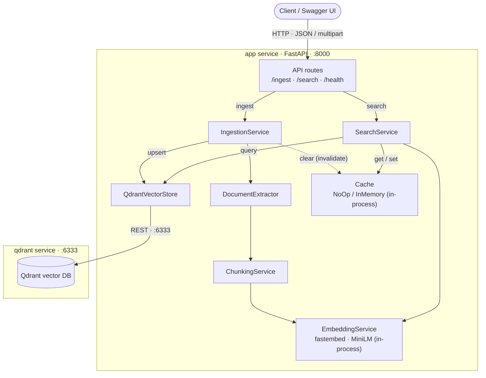

# PDF Ingestion & Semantic Search API

A fully containerized service that ingests PDF documents, embeds their text, and
lets you search the content by **meaning** (not keywords). Built with FastAPI +
Qdrant + `fastembed`, orchestrated with Docker Compose.

> Retrieval, not generation: `/search/` returns the most relevant text chunks.
> Adding an LLM on top of these results would turn it into full RAG.

---

## 1. How to run

**Prerequisites:** Docker + Docker Compose. Nothing else is installed on your
machine — all dependencies live inside the containers.

```bash
# Start everything (builds images, launches app + vector DB)
./orchestrate.sh --action start

# ...use the API (see below)...

# Stop and remove containers, volumes, and networks
./orchestrate.sh --action terminate
```

Once started:
- API: <http://localhost:8000>
- Interactive docs (Swagger UI): <http://localhost:8000/docs>
- Qdrant dashboard: <http://localhost:6333/dashboard>

> First build downloads the base image, Python deps, and bakes the embedding
> model into the image, so it takes a few minutes. Subsequent starts are fast.

### Quick smoke test

```bash
# health
curl http://localhost:8000/health

# ingest a PDF
curl -X POST http://localhost:8000/ingest/ -F "input=@data/sample.pdf"

# search
curl -X POST http://localhost:8000/search/ \
  -H "Content-Type: application/json" \
  -d '{"query": "How does semantic search work?"}'
```

---

## 2. Services

Docker Compose runs two services on a shared private network:

| Service | Image | Port | Role |
|---|---|---|---|
| `app` | built from `Dockerfile` | 8000 | FastAPI API (uvicorn). Extract → chunk → embed → search. |
| `qdrant` | `qdrant/qdrant` | 6333 | Vector database storing chunk embeddings + metadata. |

The app reaches the database at the hostname `qdrant` (the compose service name)
— no IPs, no manual wiring.

---

## 3. Endpoints

All error responses use the shape `{"error": "..."}`.

### `GET /health`
Liveness probe. → `{"status": "ok"}`

### `POST /ingest/`
Ingest one or more PDFs. `multipart/form-data`:
- `input` — one or more PDF files (repeat the field for multiple).
- `path` — *(optional)* a server-side directory of PDFs (used only when no files
  are uploaded).

```bash
curl -X POST http://localhost:8000/ingest/ \
  -F "input=@data/a.pdf" -F "input=@data/b.pdf"
```
**200** →
```json
{ "message": "Successfully ingested 2 PDF document(s).", "files": ["a.pdf", "b.pdf"] }
```
**400** → non-PDF file, no input, or invalid path. Re-ingesting a file
**replaces** its previous chunks (idempotent — no duplicates).

### `POST /search/`
Semantic search. `application/json`:
- `query` — non-empty string (required).
- `top_k` — *(optional)* integer 1–100. If provided, it must not exceed the
  number of stored chunks.

```bash
curl -X POST http://localhost:8000/search/ \
  -H "Content-Type: application/json" \
  -d '{"query": "evaluation criteria", "top_k": 3}'
```
**200** →
```json
{ "results": [ { "document": "a.pdf", "score": 0.62, "content": "..." } ] }
```
**400** → empty query, invalid `top_k`, or `top_k` greater than available chunks.

---

## 4. Architecture (and why)

A thin API on top of orchestration services and replaceable infrastructure. The
diagram below shows the components and **what talks to what** (GitHub renders it):



**Who communicates with what**
- **Client → app** over HTTP on `:8000` (JSON for `/search/`, multipart for `/ingest/`).
- **app → Qdrant** over Qdrant's REST API on `:6333` — only `QdrantVectorStore` talks to it.
- **EmbeddingService** runs the model **in-process** (baked into the image — no network call).
- **Cache** is **in-process** (NoOp/InMemory); a future `RedisCache` would add one network hop.

Layered call path: **API → Services → Infrastructure → External systems.**

**Data flow**

```
POST /ingest/  →  IngestionService  →  DocumentExtractor → ChunkingService
               →  EmbeddingService  →  QdrantVectorStore.upsert  →  Cache.clear()

POST /search/  →  SearchService  →  Cache.get  →  EmbeddingService.embed
               →  QdrantVectorStore.search  →  Cache.set  →  results
```

**Why this shape:**
- **Thin routes, logic in services** → the API is easy to read and business
  logic is unit-testable without HTTP.
- **Interfaces where replaceability is real** (`VectorStore`, `Cache`) and plain
  classes everywhere else → no unnecessary abstraction.
- **Dependency injection** (FastAPI `Depends` + singletons built once in the
  app lifespan) → expensive resources (the model, the Qdrant client) are created
  once and reused, and tests can swap in fakes.
- **Centralized config, logging, and error handling** in `app/core` → operable
  and consistent, configurable entirely through environment variables.

See [`docs/DESIGN.md`](docs/DESIGN.md) for the full rationale and the
alternatives we considered for every component.

---

## 5. Configuration

Every operational parameter is an environment variable (see `.env.example`);
no code change is needed to reconfigure. Defaults run the assessment as-is.

| Variable | Default | Purpose |
|---|---|---|
| `LOG_LEVEL` | `INFO` | Logging verbosity |
| `EMBEDDING_MODEL` | `sentence-transformers/all-MiniLM-L6-v2` | Embedding model (run via fastembed) |
| `EMBEDDING_DIM` | `384` | Vector size (must match the model) |
| `CHUNK_SIZE` / `CHUNK_OVERLAP` | `180` / `30` | Words per chunk / overlap |
| `QDRANT_HOST` / `QDRANT_PORT` | `qdrant` / `6333` | Vector DB location |
| `QDRANT_COLLECTION` | `pdf_chunks` | Collection name |
| `DISTANCE_METRIC` | `cosine` | Similarity metric |
| `TOP_K` | `5` | Default results per search |
| `SCORE_THRESHOLD` | `0.0` | Drop results below this score (0.0 = drop unrelated/negatives) |
| `CACHE_ENABLED` | `false` | Enable search-result caching |
| `CACHE_BACKEND` | `memory` | Cache backend (in-memory; Redis can be added) |
| `CACHE_TTL_SECONDS` / `CACHE_MAX_SIZE` | `300` / `1024` | Cache entry TTL / max entries |

---

## 6. Testing

Unit tests mock the external dependencies (Qdrant, the model), so they need no
running services or torch:

```bash
python -m venv .venv && . .venv/bin/activate
pip install -r requirements-dev.txt
pytest
```

Coverage: config, chunking, extraction (incl. plain-text fallback), embedding,
cache (TTL/eviction/clear), vector store, search & ingestion services, and API
validation/error paths.

---

## 7. Project structure

```
app/
├── main.py                     # create_app() + lifespan (builds singletons)
├── core/                       # config.py, logging.py, exceptions.py
├── api/
│   ├── deps.py                 # dependency-injection providers
│   ├── schemas/                # request/response models
│   └── routes/                 # health, ingest, search (thin)
├── services/                   # document_extractor, chunking, embedding,
│                               #   ingestion, search
└── infrastructure/
    ├── vector_store/           # VectorStore interface + QdrantVectorStore
    └── cache/                  # Cache interface + NoOpCache + InMemoryCache
tests/                          # mocked unit tests
Dockerfile · docker-compose.yml · orchestrate.sh · requirements*.txt · .env.example
```

---

## 8. Key design decisions at a glance

| Area | Choice | One-line why |
|---|---|---|
| API | FastAPI | async + validation + free OpenAPI/Swagger |
| Embeddings | `all-MiniLM-L6-v2` via **fastembed** (ONNX) | same model, no 450 MB torch — small image, fast start |
| Vector DB | Qdrant | real vector service: search, metadata filter, delete-by-doc |
| Chunking | word windows + overlap | simple, predictable, keeps ideas whole |
| Cache | abstraction, **off by default** (NoOpCache) | no forced Redis; enable later via config |
| Ingest | idempotent (replace per document) | re-ingesting never duplicates results |
| Search | score threshold + `top_k` capped to chunk count | no irrelevant/negative-score noise |
| Orchestration | Docker Compose + thin `orchestrate.sh` | effort in the pipeline, not the plumbing |

Full comparisons and "what we didn't pick (and when we would)" → [`docs/DESIGN.md`](docs/DESIGN.md).
