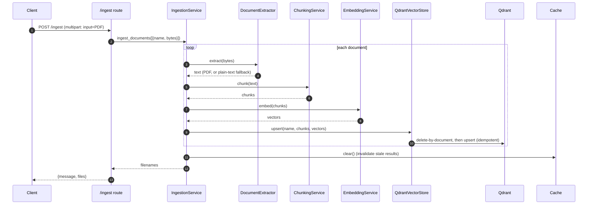
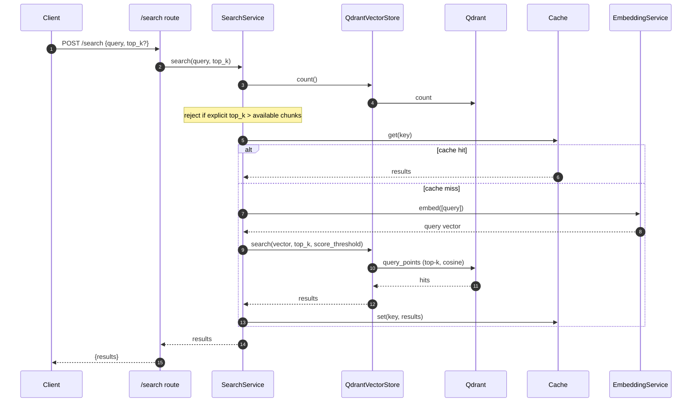

# Design & Decisions

This document explains **why** the system is built the way it is, and — for every
major component — **what alternatives were considered and why they weren't chosen
for this project**. The recurring principle:

> The assessment values *thoughtful engineering, clear reasoning, reliability, and
> understandable structure — not heavy optimization.* So each choice is the
> **simplest option that is correct and reliable for this scope**, with a clean
> seam (config value or interface) wherever the product would realistically grow.

---

## Architecture

### Layers

```
API (app/api)            Validate the request, call a service, return the response.
   ↓                     Routes stay thin — no business logic.
Services (app/services)  Orchestration (IngestionService, SearchService) and
   ↓                     processing (Chunking, Embedding, DocumentExtractor).
Infrastructure           External systems behind interfaces:
(app/infrastructure)     VectorStore → QdrantVectorStore, Cache → NoOp/InMemory.
   ↓
External systems         Qdrant, embedding model.
```

**Why layered:** separation of concerns makes the system testable and
replaceable. Business logic lives in services (unit-testable without HTTP);
external systems sit behind interfaces (swappable, mockable); the API is a thin
adapter. It reads top-to-bottom like the pipeline it implements.

### Sequence diagrams (who calls whom)

**Ingestion**



**Search**



### Dependency injection & resource lifecycle

Expensive resources — the embedding model and the Qdrant client — are created
**once** in the FastAPI *lifespan* at startup and shared via `app.state`. Routes
receive services through FastAPI's `Depends`. This gives two things:

- **Performance/reliability:** the ~model load happens once, not per request; the
  DB client (and its connection pool) is reused.
- **Testability:** tests override the DI providers with fakes, so the full suite
  runs with no real Qdrant, no model download, and no torch.

We use FastAPI's built-in `Depends` rather than a DI framework — the wiring is
small enough that a framework would be pure overhead.

### Concurrency

The assessment tests concurrent uploads. The design stays safe by:
- **Stateless services** — no shared mutable state between requests.
- **Singletons for expensive clients** — reused, not rebuilt per request.
- **Offloading blocking work** (embedding, DB calls) to a worker thread via
  `anyio.to_thread`, so CPU-bound work doesn't block the async event loop and
  requests interleave instead of serializing.

No locks or queues are added — unnecessary at this scale.

### Error handling

Centralized handlers (`app/core/exceptions.py`) convert framework and
application errors into the contract's `{"error": ...}` shape. Expected problems
raise `BadRequestError` → 400; unexpected exceptions are logged with a full
traceback but return a generic 500 (no internal details leak to clients).

### Configuration & logging

- **Config:** a single `pydantic-settings` `Settings` class; every parameter is
  env-overridable and read in exactly one place. No scattered `os.getenv`.
- **Logging:** standard `logging`, configured once from `LOG_LEVEL`; services log
  the events reviewers inspect (ingest start/complete, chunk counts, cache
  hits/misses, errors). No `print`.

---

## Component choices vs. alternatives

Each table: the alternative, **when it would win**, and **why not here**.

### Web framework — chose **FastAPI**
| Alternative | When it'd win | Why not here |
|---|---|---|
| Flask | Tiny sync app, maximum familiarity | No async, no built-in validation/OpenAPI — we'd rebuild what FastAPI gives free |
| Django / DRF | Full product w/ ORM, admin, auth | Massively over-scoped for two endpoints |
| Litestar | Very similar, marginally faster | Smaller ecosystem; FastAPI is the safer default |
| Node/Go | JS/Go team, extreme throughput | Python is the natural home for the embedding ecosystem |

### Embedding model — chose **`all-MiniLM-L6-v2`**
| Alternative | When it'd win | Why not here |
|---|---|---|
| `bge-small-en-v1.5` | Slightly better retrieval, still small | Needs a query-prefix convention; one-line config swap if we want it |
| `bge-base` / `e5-base` (768-d) | Quality over speed/size | Bigger, slower, larger vectors — overkill |
| `nomic-embed-text` | Long documents | Heavier on CPU |
| OpenAI / Cohere embedding API | Best quality, no local compute | External dep, API key, cost, data leaves the box — breaks "offline in Docker" |

### Embedding runtime — chose **fastembed (ONNX)**
| Alternative | When it'd win | Why not here |
|---|---|---|
| sentence-transformers + torch | Many models / fine-tuning / GPU | torch is ~450 MB → huge image, slow cold start |
| HF `transformers` directly | Full control of pooling/layers | More code, still pulls torch |
| TEI (embeddings server) | High-throughput embedding as a service | An extra service to operate — over-engineered here |

### Vector database — chose **Qdrant**
| Alternative | When it'd win | Why not here |
|---|---|---|
| pgvector (Postgres) | Already running Postgres; want SQL + vectors | Adds a relational DB to operate; less specialized filtering |
| FAISS | Pure in-process speed, research | A library, not a service — no persistence/API/metadata filtering out of the box |
| Chroma | Fast local prototyping | Less production-oriented |
| Weaviate / Milvus | Large-scale, advanced features | Heavier than the task needs |
| Pinecone | Managed, zero-ops at scale | SaaS + API key + cost — breaks self-contained-in-Docker |
| Elasticsearch/OpenSearch kNN | Already using ES for text | Big footprint; vectors bolted on, not core |

### Chunking — chose **fixed-size word windows + overlap**
| Alternative | When it'd win | Why not here |
|---|---|---|
| Sentence-aware splitting | Cleaner semantic boundaries | Needs a sentence tokenizer; marginal gain |
| Recursive (paragraph→sentence→word) | Structured/mixed documents | More logic; overlap already prevents mid-idea cuts |
| Token-based | Precise fit to model limit | Needs the model tokenizer; word-cap-with-margin is simpler and safe |
| Semantic / embedding-based chunking | Best retrieval quality | Slow, complex — the "heavy optimization" the brief says to avoid |

### PDF extraction — chose **pypdf + plain-text fallback**
| Alternative | When it'd win | Why not here |
|---|---|---|
| PyMuPDF (fitz) | Best fidelity + layout, fast | AGPL licensing concern; C dependency |
| pdfplumber | Tables & layout | Heavier; we only need raw text |
| Unstructured / Apache Tika | Many formats, rich parsing | Big deps (Tika needs Java) — over-scoped |
| OCR (Tesseract) | Scanned/image-only PDFs | System binary + complexity; out of scope (noted as a limitation) |

> The **fallback** matters: the grader uploads a `.pdf` that is actually plain
> text. If PDF parsing fails, we decode the raw bytes as text instead of
> erroring — graceful degradation validated against their test.

### Cache — chose **an abstraction, disabled by default**
| Alternative | When it'd win | Why not here |
|---|---|---|
| Redis now (mandatory) | Multiple app replicas sharing a cache | Forces external infra the assessment doesn't need |
| Memcached | Simple distributed cache | Same "extra infra" objection; fewer features |
| Cache embeddings (not results) | Repeated ingest of same text | Ingest isn't the hot path; caching search results is higher-value |
| `functools.lru_cache` | Dead-simple memo | No TTL, no invalidation on ingest → stale results |

See **Cache design** below for how it's disabled and how it scales later.

### Architecture / DI — chose **layered + FastAPI `Depends`**
| Alternative | When it'd win | Why not here |
|---|---|---|
| DI framework (dependency-injector, punq) | Very large app, complex wiring | Unnecessary dependency; `Depends` suffices |
| Repository pattern over the store | Frequent storage swaps, complex queries | `VectorStore` interface already gives replaceability |
| Strict hexagonal/clean architecture | Big long-lived codebase | Too much structure for two endpoints |

### Config — chose **pydantic-settings**
| Alternative | When it'd win | Why not here |
|---|---|---|
| Raw `os.getenv` | Trivial script | Scattered, untyped, no validation — the thing we were asked to fix |
| YAML/TOML files | Rich nested config | Env vars are the Docker-native, 12-factor way |
| dynaconf / Hydra | Many environments, ML sweeps | Overkill; extra dependency |

### Orchestration — chose **Docker Compose + thin `orchestrate.sh`**
| Alternative | When it'd win | Why not here |
|---|---|---|
| Kubernetes / Helm | Real multi-node production | Enormous overkill; the brief names Compose |
| Docker Swarm | Simple multi-host | Not needed for one host |
| Makefile / plain `docker run` | Personal convenience | Compose models the two services + network cleanly |

### Ingestion model — chose **synchronous request**
| Alternative | When it'd win | Why not here |
|---|---|---|
| Job queue (Celery / RQ / arq) + `job_id` + status endpoint | Large PDFs, many files, long processing | Adds a broker + workers; contract is synchronous and docs are small. **This is the primary "how would you scale?" answer.** |
| FastAPI BackgroundTasks | Fire-and-forget | Client couldn't reliably get results/status — worse than sync or a real queue |

---

## Cache design (detail)

- **Disabled for this assessment:** `CACHE_ENABLED=false` → the app injects a
  `NoOpCache` (every `get` misses, `set` is a no-op). Behaviour is identical to
  "no caching," and **no Redis or external service is required.**
- **The abstraction:** `SearchService` depends only on the `Cache` interface
  (`get/set/delete/clear`), never a concrete backend. The interface is async so
  an async backend (Redis) fits later without touching `SearchService`.
- **Enable later:** `CACHE_ENABLED=true` (+ `CACHE_BACKEND=memory`) →
  `InMemoryCache` (TTL + LRU-bounded). For multiple replicas, add a
  `RedisCache(Cache)` and select it via `CACHE_BACKEND=redis` — no business-logic
  change. (RedisCache is intentionally **not** implemented; only the seam exists.)
- **What is cached:** search results, keyed by a hash of `(normalized query, top_k)`.
- **Staleness / invalidation:** ingestion calls `Cache.clear()` after adding
  documents, so new content can't be masked by cached results; `TTL` bounds any
  other drift. Ingestion itself is never cached.

---

## Reliability refinements (found while testing)

- **Idempotent ingest** — `upsert` deletes existing chunks for a document before
  inserting, so re-ingesting a file replaces rather than duplicates.
- **Score threshold** (`SCORE_THRESHOLD`, default `0.0`) — Qdrant filters out
  chunks below the score server-side, dropping unrelated/negative-score noise.
- **`top_k` validation** — an *explicit* `top_k` greater than the number of stored
  chunks is rejected with a clear 400; an omitted `top_k` uses the default and
  returns what's available (keeps the grader's default-query test green).
- **Swagger-documented `input`** — the upload field is a typed `File` parameter so
  it appears (and works) in the Swagger UI.

---

## Trade-offs & known limitations

Things intentionally **not** built, and why:

- **No RedisCache implementation** — only the interface + `InMemoryCache`. Avoids
  an unused dependency; the seam is documented.
- **No async job queue / status endpoint** — the contract is synchronous and
  documents are small. This is the first thing to add when scaling.
- **No Qdrant persistence volume** — the graded flow is start → ingest → search →
  terminate, and `terminate` must wipe cleanly (`down -v`). A named volume is a
  one-line addition if persistence is wanted.
- **No OCR** — scanned/image-only PDFs won't yield text (extraction returns
  empty). OCR (Tesseract) would be the extension.
- **No auth / rate limiting / metrics** — out of scope for the assessment.
- **`EMBEDDING_DIM` is configured separately** and must match the chosen model;
  it could be derived from the model at startup instead.
- **In-memory cache is per-process** — fine for a single replica; use Redis for
  multiple replicas.

**Scaling path, in order:** async ingestion (job queue) → persistence volume →
enable caching (in-memory, then Redis for multi-replica) → a stronger embedding
model via `EMBEDDING_MODEL` → horizontal scaling of the app behind a load
balancer with Qdrant as the shared store.
